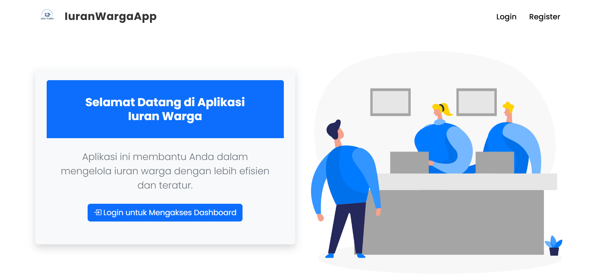

# Iuran Warga App 💻💰

**Iuran Warga App** is a web-based application built with **Laravel** that helps manage the community contribution (iuran warga) for local administrative purposes. The app provides two types of users: **Admin** and **Regular User**. Admins have full control over the system, including managing user accounts, while regular users can view and update their contribution records.

This application uses **MySQL** (via **XAMPP**) for data storage and allows users to **CRUD (Create, Read, Update, Delete)** records. Additionally, it supports **Excel** and **PDF exports** for reports.

---

## 🛠️ Features
- **Admin and User Roles**: Different user permissions for admins and regular users.
- **CRUD Operations**: Easily manage contributions with Create, Read, Update, and Delete functionalities.
- **Export to Excel & PDF**: Generate reports and export them in Excel or PDF format.
- **Dashboard Overview**: Interactive and real-time dashboard to track contributions.

---

## 📸 Dashboard Preview
Here's a preview of the dashboard you can expect:


---

## 🏃‍♂️ How to Run
To run this project on your local machine, follow the steps below:

1. **Start XAMPP** and make sure **Apache** and **MySQL** are running.

2. Clone this repository:

   ```sh
   git clone https://github.com/ikhsannovianto/Iuran-Warga-App.git
   cd Iuran-Warga-App

---

## 📜 License
This project is licensed under the **MIT License**. You can find the full text of the MIT License in the [LICENSE](LICENSE) file in this repository.
